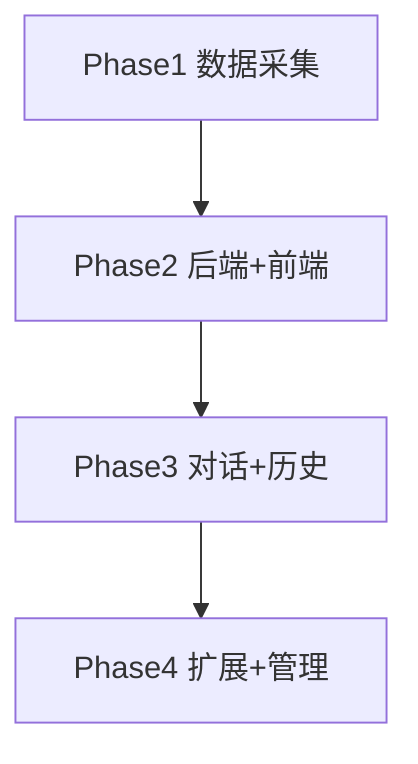

    # 原神虚拟恋人平台 - 项目开发流程

本文档指导从数据采集到网页版 MVP 的完整开发流程，供 AI 或开发者按步骤自动执行。

---

## 一、开发流程总览

### 1.1 开发循环

每个功能/模块遵循以下循环：

```
需求分析 → 设计 → 编码 → 自测 → 优化 → 提交
```

| 步骤 | 说明 | 产出物 |
|------|------|--------|
| 需求分析 | 对照 [项目设想](项目设想.md) 明确功能边界 | 任务清单 |
| 设计 | 接口定义、数据结构、目录规划 | 设计说明 |
| 编码 | 实现功能代码 | 可运行代码 |
| 自测 | 单元测试、接口测试、手动验证 | 测试报告 |
| 优化 | 修复问题、性能调优、代码规范 | 优化后的代码 |
| 提交 | Git commit，更新文档 | 版本记录 |

### 1.2 自动化原则

- **每个阶段有明确产出物**：便于 AI 判断是否完成
- **验收标准可量化**：如「接口返回 200」「测试通过率 100%」
- **任务粒度适中**：单任务可在 1–2 小时内完成
- **依赖关系清晰**：Phase 间有先后顺序，Phase 内任务可并行

---

## 二、项目目录结构

```
AIlover/
├── genshin_spider/              # 已有：Scrapy 数据采集
│   ├── genshin_spider/
│   │   ├── spiders/
│   │   ├── pipelines.py
│   │   └── settings.py
│   └── scrapy.cfg
├── backend/                     # 新建：后端 API
│   ├── app/
│   │   ├── api/                 # 路由
│   │   ├── models/              # 数据模型
│   │   ├── services/            # 业务逻辑
│   │   └── main.py
│   ├── requirements.txt
│   └── .env.example
├── frontend/                    # 新建：网页前端
│   ├── src/
│   │   ├── components/
│   │   ├── pages/
│   │   ├── api/
│   │   └── App.tsx
│   ├── package.json
│   └── vite.config.ts
├── data/                        # 新建：导出数据（Phase 1 产出）
│   ├── characters.json
│   └── images/                  # 角色图片
├── logs/                        # 已存在
│   ├── 项目设想.md
│   └── 项目开发流程.md
├── .env.example                 # 环境变量模板
└── README.md
```

---

## 三、阶段划分与任务清单

### Phase 1：数据采集与导出

**目标**：完善爬虫，导出角色数据与图片供后端使用。

| 序号 | 任务 | 说明 | 验收标准 |
|------|------|------|----------|
| 1.1 | 运行 genshin_spider | 执行 `scrapy crawl genshin_spider` 和 `character_profile_spider` | MongoDB 中有 `genshin_characters`、`genshin_character_profiles` |
| 1.2 | 编写导出脚本 | 从 MongoDB 导出为 `data/characters.json` | JSON 含 name、element、weapon、description、story、stories、images 等 |
| 1.3 | 下载角色图片 | 将图片保存到 `data/images/`，JSON 中记录本地路径 | 每个角色至少一张立绘 |
| 1.4 | 生成 System Prompt 模板 | 为每个角色生成人设描述，存入 JSON 的 `system_prompt` 字段 | 含性格、背景、说话风格 |

**产出物**：`data/characters.json`、`data/images/*`

**角色故事存储结构**（`stories` 字段）：
```json
{
  "角色详细": "在酒馆里讲起法尔伽的传奇故事...",
  "角色故事1": "法尔伽少年时第一次参加骑士考核...",
  "角色故事2": "世上本没有故乡的...",
  "角色故事3": "...",
  "角色故事4": "...",
  "角色故事5": "...",
  "「狼的还乡曲」": "...",
  "神之眼": "..."
}
```
- 按段落标题分 key，便于 AI 生成 System Prompt 时按需引用
- `story` 为兼容字段，保留全部故事合并后的长文本

---

### Phase 2：后端 API + 前端骨架 + 用户系统

**目标**：搭建可运行的前后端，实现用户注册登录。

| 序号 | 任务 | 说明 | 验收标准 |
|------|------|------|----------|
| 2.1 | 初始化后端项目 | FastAPI 或 Express，配置 CORS、环境变量 | `GET /health` 返回 200 |
| 2.2 | 数据库与模型 | 创建 users、characters、conversations、messages 表 | 可执行迁移/建表 |
| 2.3 | 用户注册/登录 API | POST /auth/register、POST /auth/login，JWT 或 Session | 注册后能登录并获取 token |
| 2.4 | 角色列表 API | GET /characters，从 data/characters.json 或 DB 读取 | 返回角色列表，含图片 URL |
| 2.5 | 角色详情 API | GET /characters/:id | 返回单个角色完整信息 |
| 2.6 | 初始化前端项目 | React + Vite + TypeScript，配置 API 基地址 | 可访问首页 |
| 2.7 | 登录/注册页面 | 表单、调用后端 API、存储 token | 能完成注册和登录 |
| 2.8 | 角色列表页 | 展示角色卡片，点击进入详情 | 展示所有角色，可跳转 |

**产出物**：可运行的前后端，用户可注册登录并浏览角色。

---

### Phase 3：对话功能 + LLM 接入 + 历史存储

**目标**：实现与角色的文字对话，保存历史。

| 序号 | 任务 | 说明 | 验收标准 |
|------|------|------|----------|
| 3.1 | 对话 API | POST /chat，接收 character_id、content，需鉴权 | 返回 AI 回复 |
| 3.2 | LLM 接入 | 调用 OpenAI/国产大模型 API，注入角色 System Prompt | 回复符合人设 |
| 3.3 | 历史上下文 | 查询最近 N 轮消息，拼入请求 | 对话有连贯性 |
| 3.4 | 消息持久化 | 将 user/assistant 消息写入 messages 表 | 可查询历史 |
| 3.5 | 历史列表 API | GET /conversations/:characterId/messages | 返回该角色与当前用户的对话记录 |
| 3.6 | 对话页面 | 聊天 UI，发送消息、展示回复、加载历史 | 完整对话流程可跑通 |
| 3.7 | 限流与错误处理 | 按用户限制调用频率，处理 API 超时/失败 | 异常时返回友好提示 |

**产出物**：用户可与角色对话，历史可保存与回溯。

---

### Phase 4：多角色、好感度、管理后台

**目标**：MVP 完整版，支持多角色切换与基础运营能力。

| 序号 | 任务 | 说明 | 验收标准 |
|------|------|------|----------|
| 4.1 | 多角色对话线程 | 每个用户+角色对应独立 conversation | 切换角色时对话互不干扰 |
| 4.2 | 好感度模型 | 表 user_character_affinity，根据互动增加好感 | 有数值变化 |
| 4.3 | 好感度 API | GET /affinity/:characterId，展示当前好感 | 前端可展示 |
| 4.4 | 管理后台入口 | /admin 路由，需管理员鉴权 | 仅管理员可访问 |
| 4.5 | 角色管理 CRUD | 增删改角色、人设、图片 | 可维护角色数据 |
| 4.6 | 用户管理 | 查看用户列表、封禁 | 可执行封禁 |
| 4.7 | 对话审计 | 查看对话记录（脱敏） | 可抽样查看 |

**产出物**：MVP 完整版，具备基础管理能力。

---

## 四、执行顺序与依赖



- Phase 1 必须先完成，为 Phase 2 提供数据
- Phase 2 完成后，Phase 3 和 Phase 4 可部分并行（对话优先，管理后台可后置）

---

## 五、技术规范

### 5.1 后端

| 项目 | 规范 |
|------|------|
| 框架 | Python FastAPI 或 Node.js + Express |
| API 风格 | RESTful，JSON 请求/响应 |
| 鉴权 | JWT，Bearer Token |
| 数据库 | SQLite（开发）/ PostgreSQL（生产） |
| 环境变量 | 使用 .env，提供 .env.example |

### 5.2 前端

| 项目 | 规范 |
|------|------|
| 框架 | React 18+，Vite |
| 语言 | TypeScript |
| 状态 | React Query / SWR 请求，Context 或 Zustand 全局状态 |
| 样式 | CSS Modules 或 Tailwind |
| 路由 | React Router v6 |

### 5.3 AI 接入

| 项目 | 规范 |
|------|------|
| 方式 | System Prompt 注入，不训练模型 |
| 模型 | OpenAI GPT / Claude / 国产大模型（按地区选择） |
| 上下文 | 最近 20 轮对话 + 角色人设 |
| 限流 | 每用户每分钟 N 次（可配置） |

### 5.4 数据模型（核心表）

```
users: id, username, password_hash, created_at
characters: id, name, element, weapon, description, system_prompt, image_url, ...
conversations: id, user_id, character_id, created_at
messages: id, conversation_id, role, content, created_at
user_character_affinity: user_id, character_id, affinity, updated_at
```

---

## 六、自测与验收流程

### 6.1 每个 Phase 结束

- [ ] 所有任务验收标准通过
- [ ] 无阻塞性 Bug
- [ ] 更新 README 或 CHANGELOG

### 6.2 后端测试

- 关键 API 使用 pytest（Python）或 jest（Node）编写单元/集成测试
- 至少覆盖：注册登录、角色列表、对话接口

### 6.3 前端测试

- 关键流程手动验证：注册 → 登录 → 选角色 → 发消息 → 查看历史
- 可选：Playwright / Cypress 做 E2E

### 6.4 验收清单（MVP 完成时）

- [ ] 用户可注册、登录
- [ ] 可浏览角色列表与详情
- [ ] 可与任意角色进行文字对话
- [ ] 对话历史可保存与回溯
- [ ] 多角色切换时对话独立
- [ ] 好感度有数值展示（可选）
- [ ] 管理后台可管理角色与用户（可选）

---

## 七、参考

- 项目设想：[logs/项目设想.md](项目设想.md)
- 数据来源：`genshin_spider` 爬取 wiki.biligame.com，存储 MongoDB
- 数据导出：Phase 1 需将 MongoDB 数据导出为 JSON，供后端使用
